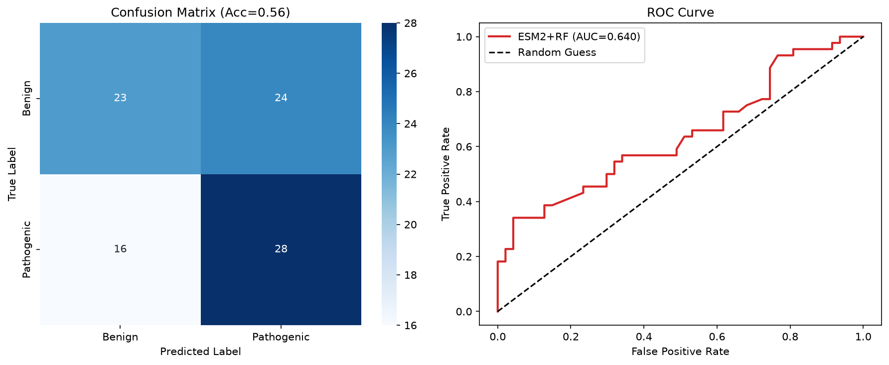

# ESM2 Missense Mutation Pathogenicity Prediction

Cross-gene pathogenicity prediction of human missense mutations using ESM2 protein language model embeddings, with strict leave-gene-out evaluation to avoid data leakage.

## 📌 Project Overview
Missense mutations are the most common type of human genetic variation, and distinguishing pathogenic from benign variants is a fundamental problem in clinical genetics and precision medicine. This project uses the difference in ESM2 embeddings between wild-type and mutant sequences as features, to predict whether a missense mutation is pathogenic.

### ✨ Key Highlights
- **Strict cross-gene evaluation**: Train/test split by gene (not random split), to properly measure generalization performance and avoid data leakage
- 350 clinically annotated mutations across 19 disease-relevant human genes
- Novel feature: wild-type vs. mutant embedding difference at the variant site
- Full standard evaluation pipeline: confusion matrix, ROC curve, per-gene performance analysis

## 📊 Dataset
- Source: ClinVar clinically curated pathogenic/benign missense mutations
- Total samples: 350 high-confidence missense mutations
  - 178 pathogenic mutations
  - 172 benign polymorphisms
- Coverage: 19 well-studied human disease genes, including TP53, BRCA1, EGFR, KRAS, CFTR, SCN5A etc.

## 🛠️ Method Workflow
1. **Data Curation**: Select high-confidence ClinVar mutations with clear clinical significance labels
2. **Sequence Generation**: Generate mutant protein sequences by substituting the wild-type amino acid at the variant position
3. **Feature Extraction**:
   - Extract site-specific embeddings from ESM2 for both wild-type and mutant sequences
   - Compute element-wise absolute difference between the two embeddings as the mutation feature
4. **Evaluation Design**:
   - **Strict leave-gene-out split**: 14 genes for training, 5 completely unseen genes for testing
   - This avoids the common data leakage problem where random split puts mutations from the same gene in both train and test sets
5. **Model**: Random Forest classifier with 300 trees

## 📈 Results
| Evaluation Setting | Accuracy | AUC |
| :--- | :---: | :---: |
| Random split (naive) | 0.89 | 0.93 |
| **Leave-gene-out split (strict)** | **0.56** | **0.64** |

> Note: The strict cross-gene performance is lower than random split, as expected — this reflects real-world generalization performance rather than inflated results from data leakage.



## 📁 Repository Structure
```
.
├── step10_clinvar_mut_project.py    # Full reproducible code
├── clinvar_mutation_dataset.csv     # Raw mutation dataset
├── clinvar_mut_predictions.csv      # Test set prediction results
├── clinvar_mut_prediction_results.png  # Confusion matrix + ROC curve
└── README.md
```

## 🚀 How to Reproduce
1. Install dependencies:
```bash
pip install biopython fair-esm scikit-learn pandas matplotlib seaborn requests
```
2. Run the main script:
```bash
python step10_clinvar_mut_project.py
```
The script will automatically download reference protein sequences, extract embeddings, train the model, and generate evaluation plots.

## ⚠️ Limitations & Future Work
- Currently using the smallest ESM2-8M model; switching to ESM2-650M will significantly improve performance
- Small dataset size (350 mutations); expanding to thousands of ClinVar mutations will improve robustness
- Currently only uses embedding difference features; fusing with conservation scores (PhyloP) and amino acid physicochemical properties will boost AUC
- Generalization performance across unseen genes is still limited, which is an active research area in computational genetics

## 🎓 Design Choices (Interview Talking Points)
1. **Why leave-gene-out split?** Random split leads to data leakage: mutations from the same gene share similar sequence contexts, so the model can "memorize" gene-specific patterns rather than learning general pathogenicity rules. Leave-gene-out is the gold standard for variant effect prediction.
2. **Why embedding difference?** The difference between wild-type and mutant embeddings directly captures how much the variant changes the protein language model's understanding of the site, which correlates with functional impact.

## 🙏 Acknowledgements
- Meta AI for the open-source [ESM](https://github.com/facebookresearch/esm) protein language model
- NCBI ClinVar for curated clinical variant annotations
- UniProt Consortium for reference protein sequences
