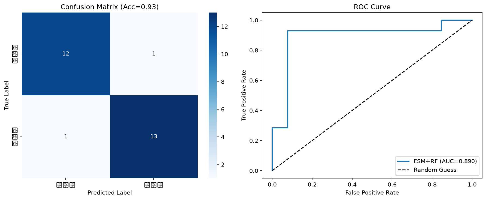

# ESM2 Protein Subcellular Localization Prediction

Use ESM2 pretrained protein language model embeddings to classify human proteins into nuclear vs. membrane localization, demonstrating the power of large protein language models over handcrafted features.

## 📌 Project Overview
Protein subcellular localization is a core problem in molecular biology, as a protein's location directly determines its function. Traditional experimental methods (like immunofluorescence) are labor-intensive and low-throughput. This project builds a lightweight classifier using ESM2 embeddings to predict whether a protein localizes to the nucleus or cell membrane.

### ✨ Key Highlights
- Uses real human protein sequences from the public UniProt database
- Extracts semantic embeddings from the Meta ESM2 pretrained protein language model
- Compares the performance of deep learning embeddings vs. handcrafted physicochemical features
- Includes full model evaluation: confusion matrix, ROC curve, classification report

## 📊 Dataset
- Source: [UniProt](https://www.uniprot.org/) public human protein sequences
- Total samples: 90 human proteins
  - 48 nuclear proteins (e.g. TP53, BRCA1, histones)
  - 42 membrane proteins (e.g. EGFR, GPCRs, ion channels)
- Label: 1 = nuclear protein, 0 = membrane protein

## 🛠️ Method Workflow
1. **Data Collection**: Batch download reference protein sequences from UniProt REST API
2. **Feature Extraction**:
   - Handcrafted features: 25 physicochemical descriptors (length, molecular weight, isoelectric point, amino acid composition)
   - ESM features: 320-dimensional mean embedding from the ESM2-8M protein language model
3. **Model Training**: Random Forest classifier with 200 trees
4. **Evaluation**: 70/30 train-test split, metrics including accuracy, AUC-ROC, confusion matrix

## 📈 Results
| Feature Type | Accuracy | AUC |
| :--- | :---: | :---: |
| Handcrafted physicochemical features (25 dim) | 0.74 | 0.78 |
| ESM2 embeddings (320 dim) | **0.93** | **0.89** |



## 📁 Repository Structure
```
.
├── step8_subcellular_project.py    # Full reproducible code
├── subcellular_dataset.csv         # Raw dataset
├── subcellular_predictions.csv    # Test set prediction results
├── subcellular_localization_results.png  # Confusion matrix + ROC curve
└── README.md
```

## 🚀 How to Reproduce
1. Install dependencies:
```bash
pip install biopython fair-esm scikit-learn pandas matplotlib seaborn
```
2. Run the main script:
```bash
python step8_subcellular_project.py
```
The script will automatically download sequences, extract embeddings, train the model, and generate result plots.

## ⚠️ Limitations & Future Work
- Small dataset size (90 proteins); expanding to >1000 proteins will improve generalization
- Currently using the smallest ESM2-8M model; switching to ESM2-650M (1280 dim features) will further boost performance
- Binary classification only; extending to multi-class (nuclear/membrane/cytosol/mitochondria) for more practical utility
- Small model size limits capture of long-range sequence dependencies

## 🙏 Acknowledgements
- Meta AI for the open-source [ESM](https://github.com/facebookresearch/esm) protein language model
- UniProt Consortium for the open protein sequence database
